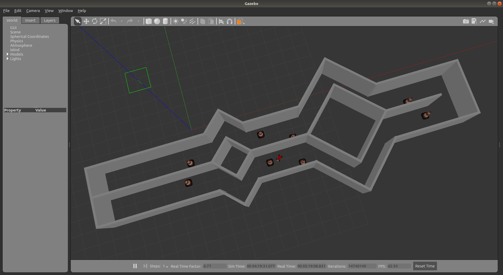
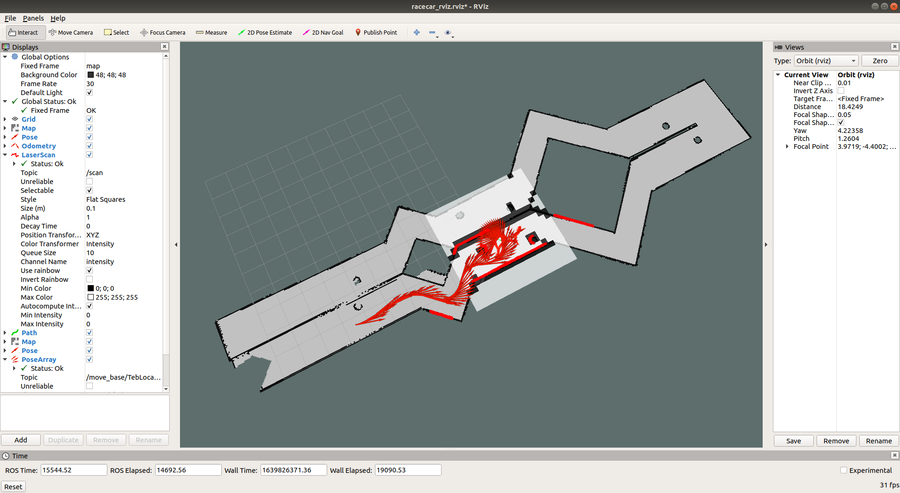

# 智能车仿真

代码使用参考教程：[教程地址](https://www.guyuehome.com/6463)

---

## Dependencies

```sh
rosdep install --from-paths src --ignore-src --rosdistro $ROS_DISTRO -y
```

## Build

```sh
catkin build -DCMAKE_BUILD_TYPE=Release
```

## Run

```sh
# step 1
roslaunch racecar_gazebo racecar_runway.launch
# or
roslaunch racecar_gazebo racecar_runway_navigation.launch

# step 2
roslaunch racecar_gazebo racecar_rviz.launch

# step 3
rosrun racecar_gazebo path_pursuit.py
```

<p align="center">
  
  
</p>

ROS Frames:

<p align="center">
  
</p>

ROS Graph:

<p align="center">
  
</p>

### with darknet_ros

* change camera topic in `ros.yaml`

  ```yaml
  subscribers:
    camera_reading:
      topic: /camera/zed/rgb/image_rect_color
      queue_size: 1
  ```

* run

  ```sh
  roslaunch darknet_ros darknet_ros.launch
  ```